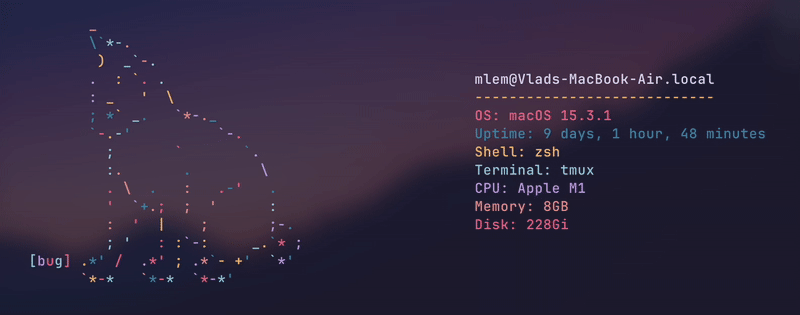

<h3 align="center"></h3>

A colorful terminal cat animation displaying system information, written in bash

[Add any other relevant badges here]

  

[Your main description here - explaining what the project does and its main purpose]

[Technical details and customization options]

[Supported systems and requirements]

### More: 
- [Dependencies]
- [Installation]
- [Configuration]
- [Usage]
